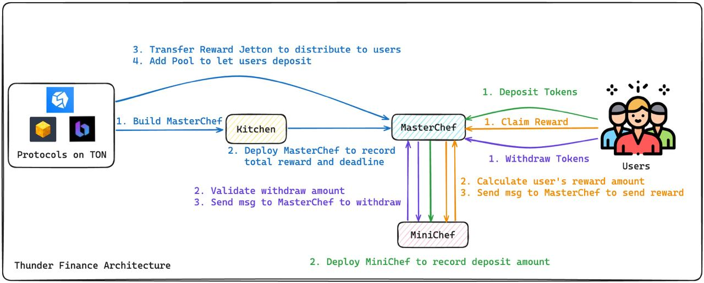

# ⛰️ Architecture

<figure><figcaption>
Follow the flow: Start with <mark style="color:blue;">blue for protocol setup</mark>, then <mark style="color:green;">green for deposits</mark>, <mark style="color:orange;">orange to claim rewards</mark>, and <mark style="color:purple;">purple for withdrawals.</mark>
</figcaption></figure>

## **Protocol Interaction Steps**

1. Configure the Liquidity Mining Pool in the Kitchen Contract:
   * Set the type of reward token to be distributed.
   * Define the quantity of rewards.
   * Establish the deadline for reward distribution.
   * Kitchen will deploy MasterChef to store information (total reward, deadline)
2. Transfer Reward Tokens to MasterChef:&#x20;
   * Transfer Reward Tokens for distribution to users.
3. Add New Pools in MasterChef:
   * Specify the type of Token users are required to stake.

Once these steps are completed, farming can officially begin.


**Reward Token Setup:**

1. **TON as Reward Token**: Direct transfer of TON tokens during the deployment of MasterChef.
2. **Jetton as Reward Token**: An additional step is required to transfer Jetton tokens to MasterChef.


## **User Interaction Steps**

1. Stake Specified Tokens:
   * Users start by staking the specified tokens into the MasterChef contract.
2. MiniChef Contract Deployment:
   * MasterChef deploys a user-specific MiniChef contract to record the staked amount and track reward information.
3. Start Earning Rewards:
   * Once tokens are staked, users immediately begin to accumulate rewards.
4. Claiming Rewards:
   * When users claim rewards, MasterChef sends the latest reward information to MiniChef.
   * MiniChef calculates the amount of reward the user is entitled to and relays this information back to MasterChef.
   * MasterChef then distributes the reward tokens to the user.
5. Withdrawing Tokens:
   * Upon withdrawal requests, MasterChef verifies with MiniChef that a sufficient amount is available for withdrawal.
   * Once confirmed, MasterChef proceeds to withdraw the tokens to the user.
