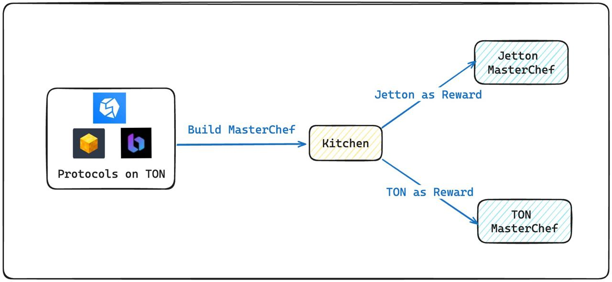

# 1️⃣ What is Kitchen ?

## **Kitchen Contract Introduction**

<figure><figcaption>
High-level technical overview of Kitchen Contract
</figcaption></figure>

**The Kitchen Contract, deployed by Thunder Finance, helps protocols such as STON fi and Dedust quickly set up their liquidity mining pools**. Protocols only need to provide the address of the Reward Token, total reward and the deadline for reward distribution. Based on this information, the Kitchen Contract will manage the deployment of the MasterChef contract.

Thunder Finance offers two reward options for protocols:

1. **TON as the Reward Token**
2. **Jetton as the Reward Token**

We will provide a more detailed introduction to these methods in the following sections.

### **1. Jetton MasterChef: Jetton as Reward Token**

When setting up a Jetton MasterChef, protocols must provide three pieces of information:

* **Jetton Master Address:** This address is used to calculate the MasterChef's Reward Token wallet address, facilitating the verification of whether protocols have successfully transferred the reward tokens.
* **Total Reward:** The total amount of rewards that will be distributed.
* **Reward Deadline:** The deadline for distributing the rewards.

Thunder Fi will deploy a dedicated Jetton MasterChef contract for each protocol to store all relevant liquidity mining information. Protocols must interact directly with their Jetton MasterChef contract to transfer Reward Tokens and add pools, specifying which tokens users are allowed to stake.


For detailed operational steps, please refer to the [Jetton MasterChef introduction](what-is-masterchef.md#jetton-masterchef-for-protocols).


### **2. TON MasterChef: TON as Reward Token**

When setting up a TON MasterChef, protocols must provide two pieces of information:

* **Total Reward:** The total amount of rewards that will be distributed.
* **Reward Deadline:** The deadline for distributing the rewards.

Unlike Jetton MasterChefs, which require an additional step to transfer Jetton rewards, TON MasterChefs allow for direct transfer of TON amounts during the MasterChef’s deployment.

Thunder Fi will deploy a dedicated TON MasterChef contract for each protocol to store all relevant liquidity mining information. Protocols must interact with the TON MasterChef to add pools, specifying which tokens users are allowed to stake.


For detailed operational steps, please refer to the [TON MasterChef introduction](what-is-masterchef.md#ton-masterchef-for-protocols).

