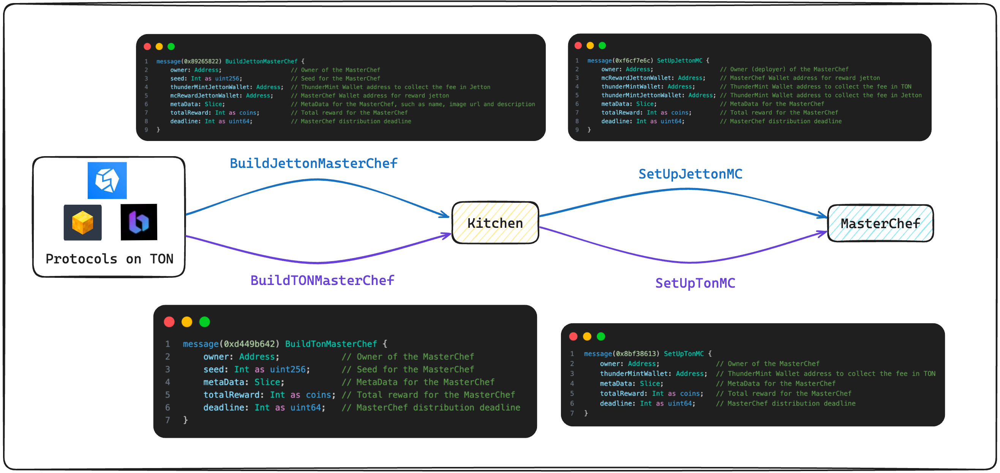

# 📨 Message Flows


If you would like to see the complete interaction of messages between contracts, you can refer to this [link](https://github.com/Ton-Dynasty/ThunderMint).


## Kitchen & MasterChef

### Protocols build MasterChef

<figure><figcaption>
Message flow when Kitchen deploys MasterChef 
</figcaption></figure>

Protocols send a `BuildJettonMasterChef` or `BuildTonMasterChef` message to the Kitchen, which then sends a `SetUpJettonMC` or `SetUpTonMC` message to deploy the MasterChef while also recording relevant information.

### Protocols transfer reward token to  MasterChef

<figure><figcaption>
Protocols transfer reward token to Jetton MasterChef
</figcaption></figure>

You can see the `JettonInternalTransfer` and `JettonTransferNotification`  TLB scheme in [https://github.com/ton-blockchain/TEPs/blob/master/text/0074-jettons-standard.md](https://github.com/ton-blockchain/TEPs/blob/master/text/0074-jettons-standard.md)


If using TON as the reward token, the rewards in TON are transferred to the TON MasterChef concurrently during the `SetUpTonMC` process.


### Protocols add pool in MasterChef

<figure><figcaption>
Protocols add pool
</figcaption></figure>

Protocols add pools, specifying which tokens users are allowed to stake.

## MasterChef & MiniChef

### User deposit token to MasterChef

<figure><figcaption>
User Deposit token
</figcaption></figure>

* Users first send a `JettonTransfer` to their wallet.
* The user's wallet then transfers tokens to the MasterChef Jetton wallet.
* The Master Jetton Wallet sends a `JettonTransferNotification` to MasterChef to confirm the deposit.
* MasterChef responds by sending a `UserDeposit` message to deploy MiniChef and record relevant information.

### User Harvest their reward from MasterChef

<figure><figcaption>
User harvest their reward
</figcaption></figure>

A user sends a `Harvest` message to MasterChef, and MasterChef then confirms the amount of rewards the user can receive through `HarvestInternal` and `HarvestInternalReply`. Once confirmed, the rewards are transferred to the user.

### User Withdraw tokens from MasterChef

<figure><figcaption>
User withdraw their token
</figcaption></figure>

A user sends a `Withdraw` message to MasterChef, and MasterChef then confirms through `WithdrawInternal` and `WithdrawInternalReply` that the user has sufficient balance to unstake. Once confirmed, the transfer is made to the user.

### User Withdraw and Harvest in one step

<figure><figcaption>
User withdraw and harvest in one tx
</figcaption></figure>

A user sends a `WithdrawAndHarvest` message to MasterChef, which then uses `WithdrawAndHarvestInternal` and `WithdrawAndHarvestReply` to confirm both the amount of rewards the user can receive and that the user has a sufficient balance to unstake. Once confirmed, MasterChef transfers both the reward tokens and the unstaked tokens to the user.
